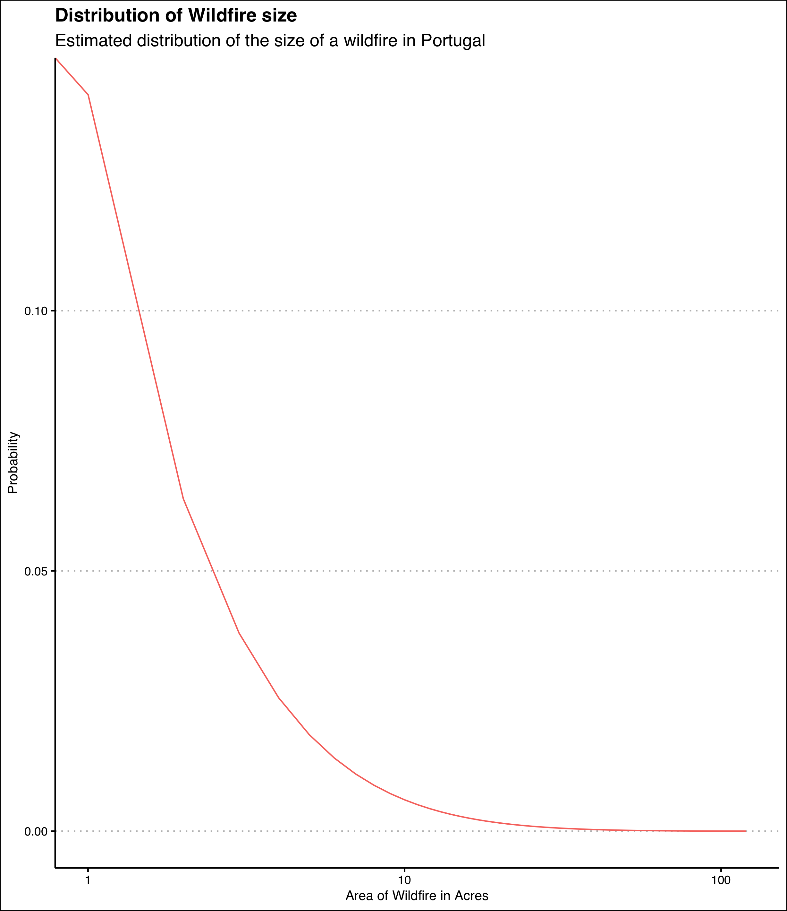

```{r setup, include = FALSE}
library(rlang)
library(flexdashboard)
library(shiny)
library(jsonlite)
library(maptools)
library(ggplot2)
library(ggthemes)
library(tidyr)
library(dplyr)
library(purrr)
library(leaflet)
library(plotly)

source("proc.R")
# sites <- fromJSON(flatten=TRUE,
#   "https://raw.githubusercontent.com/ottlngr/2016-15/ottlngr/ottlngr/sites.json")
# 
# sites$locations <- map(sites$locations, function(x) {
#   if (nrow(x) == 0) {
#     data_frame(latitude=NA, longitude=NA, postal_code=NA, name=NA, street_address=NA)
#   } else {
#     x
#   }
# })
# 
# sites <- unnest(sites)
# sites <- sites[complete.cases(sites[,c("longitude", "latitude")]),]
# 
# sites$ratingcol <- ifelse(sites$site.rating == 0, "orange",
#                           ifelse(sites$site.rating == 1, "green",
#                                  ifelse(sites$site.rating == 2, "red", "black")))
# 
# sites$ratingf <- factor(sites$site.rating,
#                         levels=c(3:0),
#                         labels=c("Remote or no potential for radioactive contamination.",
#                                  "No authority to clean up or status unclear.",
#                                  "Cleanup declared complete.",
#                                  "Cleanup in progress."))
# 
# sites$campus <- ifelse(grepl("University", sites$site.name) | 
#                        grepl("University", pattern = sites$street_address) | 
#                        grepl("Campus", sites$street_address), 1, 0)
# sites$campuscol <- ifelse(sites$campus == 1, "red", "black")
```

Column {data-width=350}
-----------------------------------------------------------------------
### Burnt Area (Source: EFFIS)

```{r}
effis_ba_bars
```

### Number of Fires (Source: EFFIS)

```{r}
effis_nf_bars
```

Column {data-width=350}{.tabset}
-----------------------------------------------------------------------

### A rough distribution

```{r picture, echo = F, fig.cap = "Title", out.width = '100%'}

```

### Putting Fires into perspective
```{r}
malta
```

### An Overview of Wildfires in the Past Week

```{r}
modis_map
```

Column {data-width=300}
-------------------------------------

### Portugal is the only country in Europe to observe an increase in wildfires in the past decade (Source: EFFIS)

```{r}
ba_decade
```

### Average Fire Size
```{r}
avg_size
```